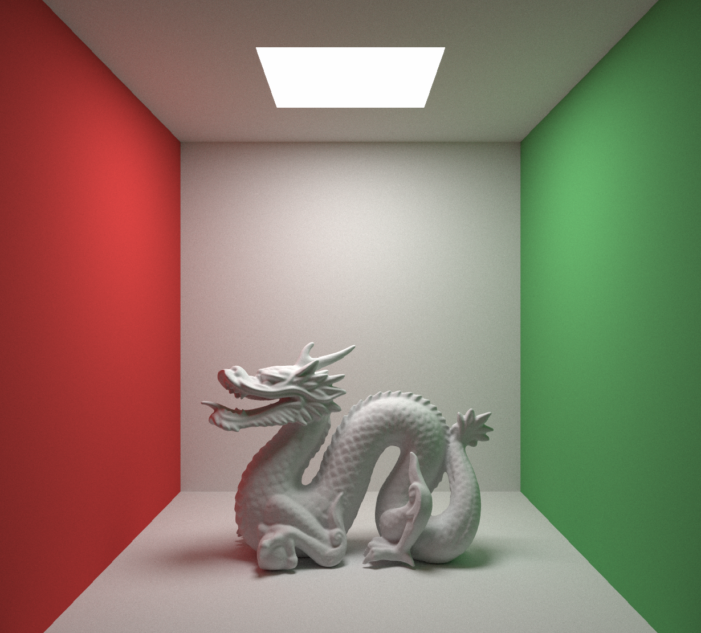
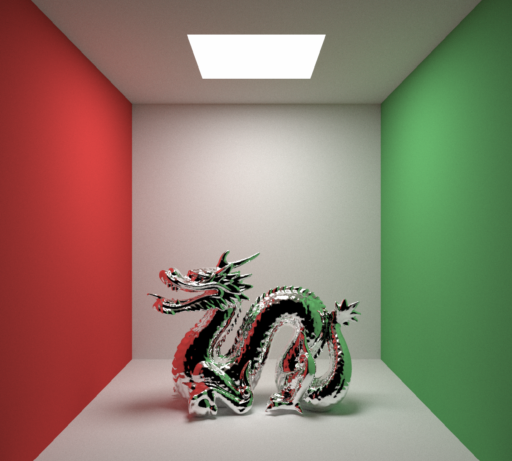
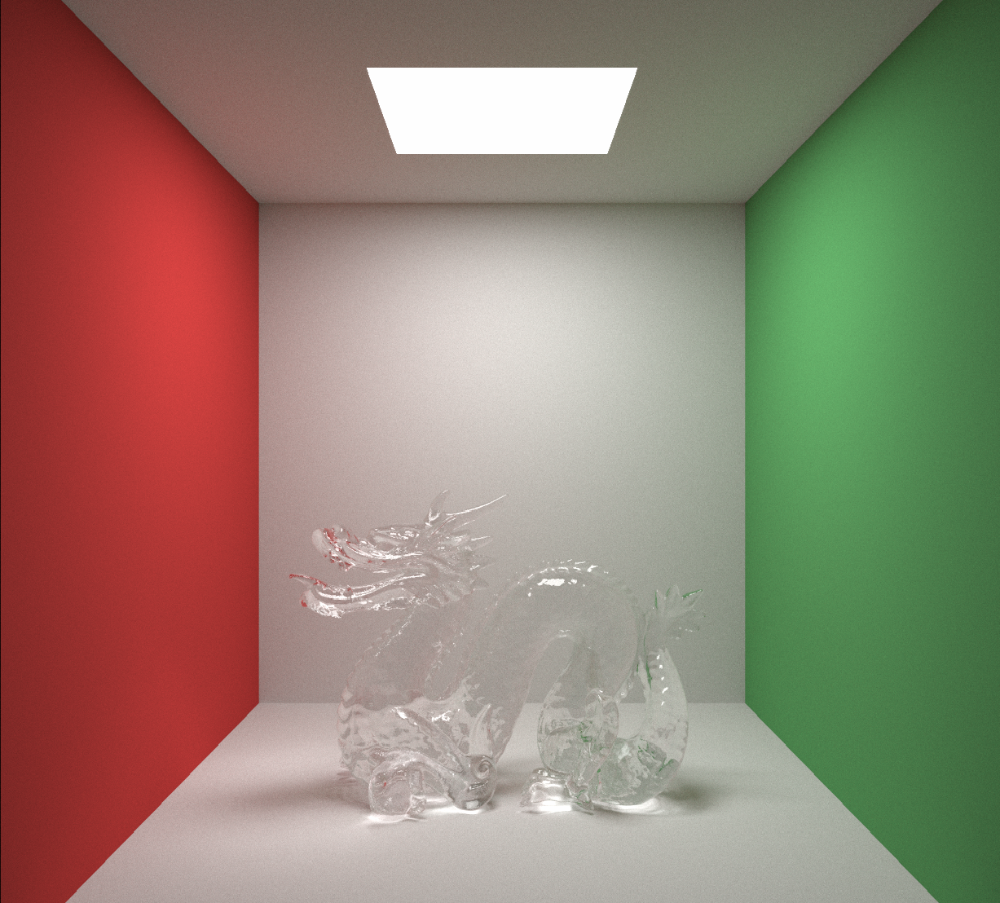
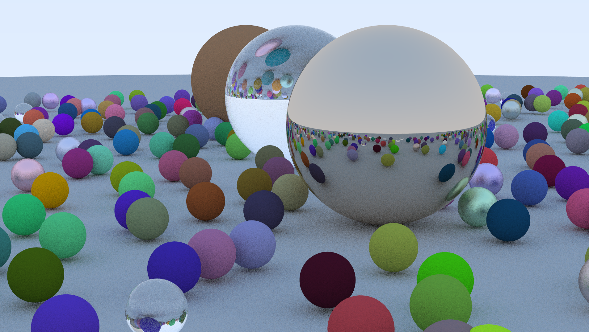

## Notes
- BVH = Bounding Volume Hierarchy (used for acceleration)
  - The BVH is built with a median-split strategy along the longest axis of each AABB.
  - This approach delivers very fast build times (≈O(n log n)), but is less optimized for ray-tracing cost. A binned Surface Area Heuristic (SAH) pass will improve traversal performance further.
  - We traverse this tree structure on the GPU iteratively as opposed to recursively, as it maximizes register usage and minimizes branch divergence.
- A technique called russian roulette is used to terminate rays that have low contribution early.

 

## Render Configuration
- GPU: **RTX 4070 Mobile** | CPU: **i7-13650HX**
- Resolution: **1920×1080 pixels**
- Rays per Pixel: **10000**
- Maximum Bounce Depth: **15**
- Scene: **Cornell Box, Stanford Dragon (871306 triangles)**
## Performance Results

| Platform     | Acceleration | Time         |
|--------------|--------------|--------------|
| GPU (CUDA)   | BVH, Flat Traversal | ~999.8 seconds|

 
 

## Render Configuration
- GPU: **RTX 4070 Mobile** | CPU: **i7-13650HX**
- Resolution: **800×600 pixels**
- Rays per Pixel: **10**
- Maximum Bounce Depth: **12**
- Scene: **Same from final output of "Ray Tracing in One Weekend" by Peter Shirley and more. https://raytracing.github.io/books/RayTracingInOneWeekend.html**

## Performance Results

| Platform     | Acceleration | Time         |
|--------------|--------------|--------------|
| CPU          | N/A          | ~1800 seconds|
| CPU          | BVH          | ~142 seconds |
| GPU (CUDA)   | N/A          | ~0.28 seconds|
| GPU (CUDA)   | BVH, Flat Traversal | ~0.06 seconds|

(Image uses 1000spp)

